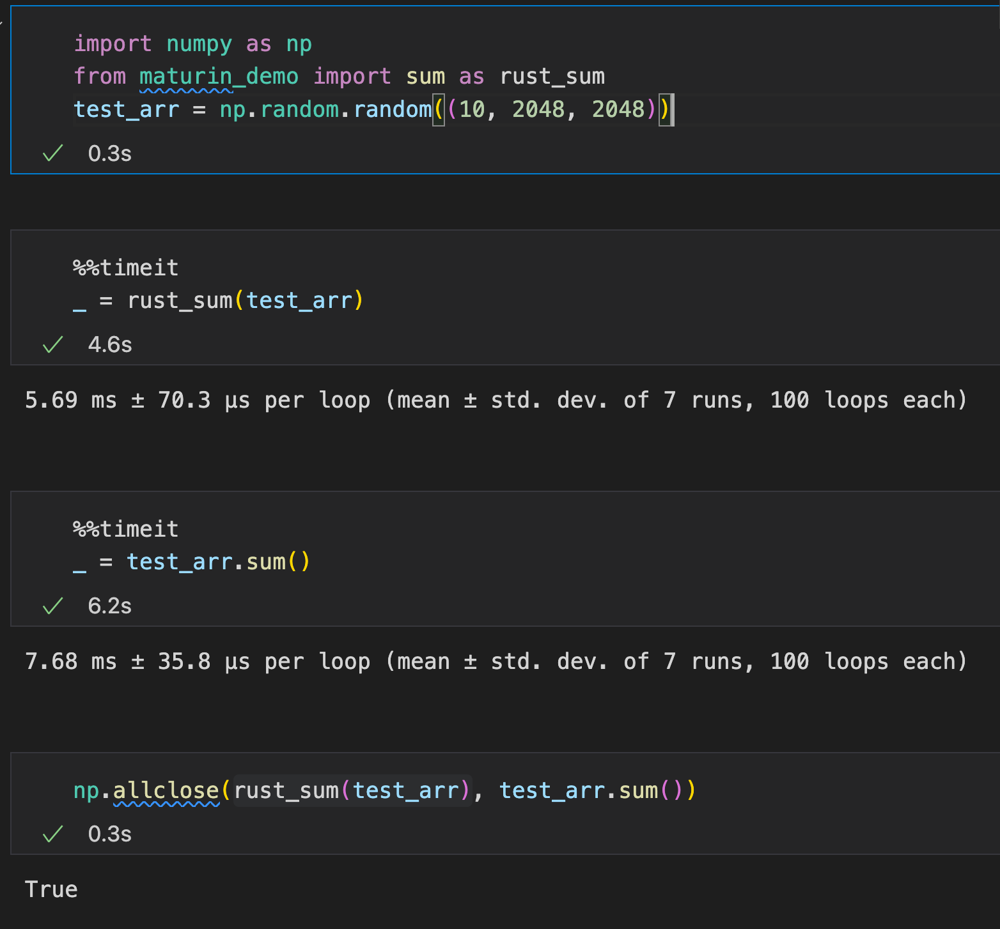

# maturin-demo

### Install Rust
```shell
curl --proto '=https' --tlsv1.2 -sSf https://sh.rustup.rs | sh
```

### Install packages in Python
```shell
pip install maturin numpy jupyter
```

### Initialize `maturin` project
```
maturin init
```
Choose `pyo3` option.

This will create a series of folders for you, including `src/` and a file `lib.rs`.

The original `lib.rs` will have a _hello world_ example:
```rust
use pyo3::prelude::*;

/// Formats the sum of two numbers as string.
#[pyfunction]
fn sum_as_string(a: usize, b: usize) -> PyResult<String> {
    Ok((a + b).to_string())
}

/// A Python module implemented in Rust.
#[pymodule]
fn maturin_demo(_py: Python, m: &PyModule) -> PyResult<()> {
    m.add_function(wrap_pyfunction!(sum_as_string, m)?)?;
    Ok(())
}
```

### Compile the extension
```shell
maturin develop 
```
Adding the `-r` flag like this: `maturin develop -r` will compile with optimizations (slower compile, but faster runtime). 

_Note: this will automatically install the package into the target environment_

### Use new Python extension
```python
from maturin_demo import sum_as_string
sum_as_string(1, 2)
>>> '3'
```

### Let's add some crates


These crates will allow us to interact with numpy arrays and/or interact with them in Rust equivalents. 

### Creating an equivalent `sum`

```rust
#[pyfunction]
fn sum_loop(_py: Python<'_>, arr: &PyArrayDyn<f64>) -> f64 {
    let mut res: f64 = 0.;
    for v in arr.readonly().as_array().iter(){
        res = res + v;
    }
    return res;
}
```

Or better yet:

```rust
#[pyfunction]
fn sum(_py: Python<'_>, arr: &PyArrayDyn<f64>) -> f64 {
    return arr.readonly().as_array().sum();
}
```

### Is it fast?

Yes.




### Build a `.whl`

```shell
maturin build -r -i=/home/ubuntu/maturin-demo/.venv/bin/python
```
_Note: `-i` is the target interpreter_

The .whl can be found in `./target/wheels/`
